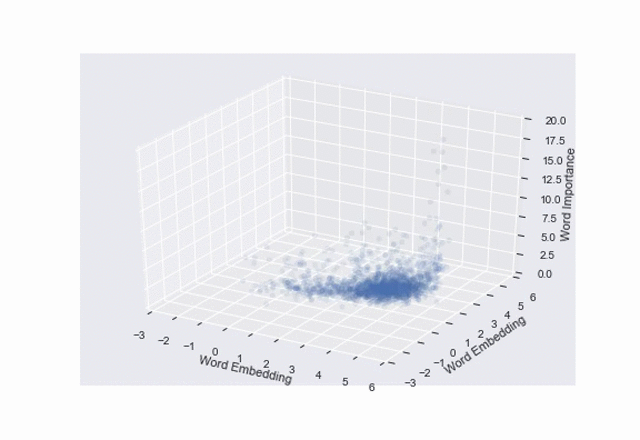

# Machine Learning Engineer Nanodegree Capstone Project
Here is my capstone project from the Udacity Machine Learning Nanodegree.

## Overview
This project attempts to extract useful signal from the text of public company quarterly earnings transcripts. Although the proposed approach does not prove to be successful, this notebook contains interesting analysis and a few potential developments that could improve this model to a useful (and profitable) level.

For more detailed analysis, read the written report [here](/Stock\ price\ forecasting.pdf).

For a short summary:

This project attempts to learn correlations between words used in a quarterly earnings call and stock price movements. The hypothesis was that companies would use different language during their quarterly earnings calls depending on their situation. However, it was found that the words used were largely the same from call to call. The animation below demonstrates this, plotting words used in the x and y axis, and denoted the word importance along the z axis. Each frame represents a quarterly earnings call, spanning from 2006 through 2016.



## Data
##### Stock price
Price data is downloaded from Google Finance using the Pandas DataReader. See notebook to run the command to download all necessary data.

##### Quarterly earnings call transcripts
Transcripts are scraped from [Seeking Alpha](https://seekingalpha.com/) using the Python library [Scrapy](https://docs.scrapy.org/en/latest/).

To fetch a company transcript, complete the following steps.

```
cd data/
scrapy crawl transcripts -a symbol=$SYM
```

This will download all of the posted earnings call transcripts for company `SYM` and store it as a JSON lines file in `data/company_transcripts/SYM.json`.

Note: The transcripts provided by Seeking Alpha are protected by copyright and can not be used for commercial interests. However, given the educational nature of this project as part of the Udacity Machine Learning Nanodegree, use of this information is permitted under the Copyright Fair Use principle. This said, data is NOT provided in this repo in order to abide by Seeking Alpha's copyright requests.

## Getting started
Create a new Anaconda environment using the command below to ensure your workspace has all necessary dependencies.

```
conda env create -f requirements/environment.yml
```

Activate the conda environment.

```
source activate stock-price-forecasting
```

Launch the Jupyter notebook.

```
jupyter notebook
```
